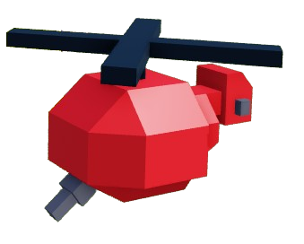
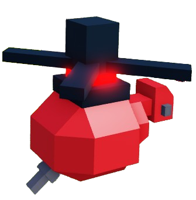

# Air Units


As you may see, a lot of the stats are uncalculated. Please read what I put after the embedded spreadsheet in the [Resources and Data](../resources-and-data.md) page if you'd like to help.


## Transport Copter

| Statistic Name | Current Data |
| -------------- | ------------ |
| Cost           | 45           |
| Supply         | 1            |
| Training Time  | 15           |
| HP             | 70           |
| Speed          | 3            |

The Transport Copter is a unique unit: it is not used to attack, but rather it functions as a unit carrier.

It holds 10 units. The units cannot be vehicles or other air units, but anything else is good.

Click "F" with units positioned near the copter to pick them up. Click F again to drop the units.


Even if you're chatting, typing F will release the units


Skins

## Chopper

| Statistic Name          | Current Data |
| ----------------------- | ------------ |
| Cost                    | 64           |
| Supply                  | 2            |
| Training Time           | 20           |
| HP                      | 90           |
| Speed                   | 4.3          |
| Range                   | Uncalculated |
| Attack Damage           | 11           |
| Attack Speed            | Uncalculated |
| DPS (Damage Per Second) | Uncalculated |

The Chopper is widely considered one of, if not the best unit in NRTS in terms of versatility. It probably has too much damage, is very speedy, and doesn't face the hurdles many ground units do.

In most games, choppers are a must-have. They can be used to target enemy farms easily, and they can quickly escape if needed because of their speed.

Because they're flying, they are also very easily abused to kill enemy CCs because they won't get distracted by things such as the farms near the CC as long as they're positioned correctly.

Skins

<- Base Chopper Skin <- Tophat Chopper Skin

## Big Transport Copter

| Statistic Name | Current Data |
| -------------- | ------------ |
| Cost           | 70           |
| Supply         | 1            |
| Training Time  | 20           |
| HP             | 85           |
| Speed          | 2.5          |

Has the same function as the regular [Transport Copter](air-units.md#transport-copter), but can hold 15 units and now can also hold vehicles

Skins

## Hornet

| Statistic Name          | Current Data |
| ----------------------- | ------------ |
| Cost                    | 84           |
| Supply                  | 2            |
| Training Time           | 30           |
| HP                      | 70           |
| Speed                   | 3            |
| Range                   | 11           |
| Attack Damage           | Uncalculated |
| Attack Speed            | Uncalculated |
| DPS (Damage Per Second) | Uncalculated |

The hornet is a unique air unit.

It only targets ground units and does quite a bit of damage.

But it's widely considered the worst unit because it can be not only easily countered by fighters or choppers, but also flies lower than other air units meaning it gets stuck a lot.

There's simply no reason to use them over choppers.

Skins

## Fighter

| Statistic Name          | Current Data |
| ----------------------- | ------------ |
| Cost                    | 84           |
| Supply                  | 2            |
| Training Time           | 20           |
| HP                      | 80           |
| Speed                   | 3.5          |
| Range                   | 18           |
| Attack Damage           | Uncalculated |
| Attack Speed            | Uncalculated |
| DPS (Damage Per Second) | Uncalculated |

Fighters are a special unit that only attack air.

Unlike Hornets only targeting ground, only targetting air whilst doing heavy damage is very good at countering other air units, especially Choppers.

Skins

